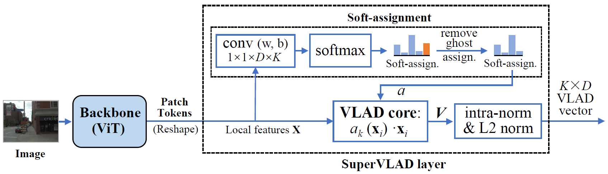

# SuperVLAD
This is the official repository for the NeurIPS 2024 paper "[SuperVLAD: Compact and Robust Image Descriptors for Visual Place Recognition](https://proceedings.neurips.cc/paper_files/paper/2024/hash/0b135d408253205ba501d55c6539bfc7-Abstract-Conference.html)".



## Getting Started

This repo follows the framework of [GSV-Cities](https://github.com/amaralibey/gsv-cities) for training, and the [Visual Geo-localization Benchmark](https://github.com/gmberton/deep-visual-geo-localization-benchmark) for evaluation. You can download the GSV-Cities datasets [HERE](https://www.kaggle.com/datasets/amaralibey/gsv-cities), and refer to [VPR-datasets-downloader](https://github.com/gmberton/VPR-datasets-downloader) to prepare test datasets.

The test dataset should be organized in a directory tree as such:

```
├── datasets_vg
    └── datasets
        └── pitts30k
            └── images
                ├── train
                │   ├── database
                │   └── queries
                ├── val
                │   ├── database
                │   └── queries
                └── test
                    ├── database
                    └── queries
```

Before training, you should download the pre-trained foundation model DINOv2(ViT-B/14) [HERE](https://dl.fbaipublicfiles.com/dinov2/dinov2_vitb14/dinov2_vitb14_pretrain.pth).

## Train
```
python3 train.py --eval_datasets_folder=/path/to/your/datasets_vg/datasets --eval_dataset_name=pitts30k --foundation_model_path=/path/to/pre-trained/dinov2_vitb14_pretrain.pth --backbone=dino --supervlad_clusters=4 --crossimage_encoder --patience=3 --lr=0.00005 --epochs_num=20 --train_batch_size=120 --freeze_te 8
```

## Test

To evaluate the trained model:

```
python3 eval.py --eval_datasets_folder=/path/to/your/datasets_vg/datasets --eval_dataset_name=pitts30k --resume=/path/to/trained/model/SuperVLAD.pth --backbone=dino --supervlad_clusters=4 --crossimage_encoder
```

## SuperVLAD without cross-image encoder

Remove parameter `--crossimage_encoder` to run the SuperVLAD without cross-image encoder.

## 1-cluster VLAD

Set `--supervlad_clusters=1` and `--ghost_clusters=2` to run the 1-cluster VLAD.

For example,

```
python3 eval.py --eval_datasets_folder=/path/to/your/datasets_vg/datasets --eval_dataset_name=pitts30k --resume=/path/to/trained/model/SuperVLAD.pth --backbone=dino --supervlad_clusters=1 --ghost_clusters=2
```

## Trained Model

<table style="margin: auto">
  <thead>
    <tr>
      <th>model</th>
      <th>cross-image<br />encoder</th>
      <th>download</th>
    </tr>
  </thead>
  <tbody>
    <tr>
      <td>SuperVLAD</td>
      <td align="center">:x:</td>
      <td><a href="https://drive.google.com/file/d/1wRkUO4E8s5hNRNNIWcuA8RUvlGob3Tbf/view?usp=drive_link">LINK</a></td>
    </tr>
    <tr>
      <td>SuperVLAD</td>
      <td align="center">:white_check_mark:</td>
      <td><a href="https://drive.google.com/file/d/1yomnWGTJko6nf3F2Ju6RWsLhP2EG82tL/view?usp=drive_link">LINK</a></td>
    </tr>
  </tbody>
</table>

## Acknowledgements

Parts of this repo are inspired by the following repositories:

[GSV-Cities](https://github.com/amaralibey/gsv-cities)

[Visual Geo-localization Benchmark](https://github.com/gmberton/deep-visual-geo-localization-benchmark)

[DINOv2](https://github.com/facebookresearch/dinov2)

## Citation

If you find this repo useful for your research, please cite the paper

```
@inproceedings{lu2024supervlad,
  title={SuperVLAD: Compact and Robust Image Descriptors for Visual Place Recognition},
  author={Lu, Feng and Zhang, Xinyao and Ye, Canming and Dong, Shuting and Zhang, Lijun and Lan, Xiangyuan and Yuan, Chun},
  booktitle={Advances in Neural Information Processing Systems},
  volume={37},
  pages={5789--5816},
  year={2024}
}
```
